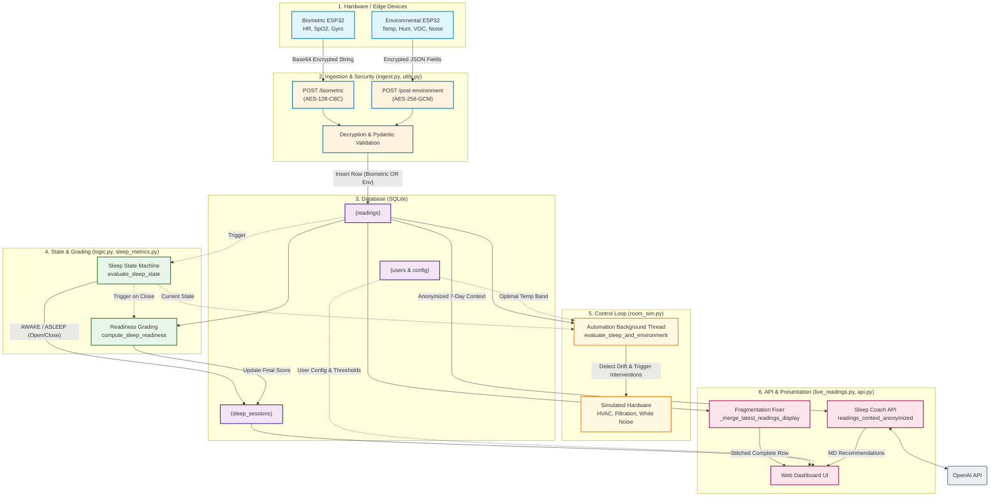

```mermaid 
flowchart TD
    %% Styling
    classDef edge fill:#e1f5fe,stroke:#0288d1,stroke-width:2px;
    classDef ingest fill:#fff3e0,stroke:#0277bd,stroke-width:2px;
    classDef db fill:#f3e5f5,stroke:#4527a0,stroke-width:2px;
    classDef logic fill:#e8f5e9,stroke:#2e7d32,stroke-width:2px;
    classDef auto fill:#fff8e1,stroke:#f57f17,stroke-width:2px;
    classDef pres fill:#fce4ec,stroke:#ad1457,stroke-width:2px;
    classDef ext fill:#eceff1,stroke:#607d8b,stroke-width:2px;

    %% Components
    subgraph Edge_Devices ["1. Hardware / Edge Devices"]
        ESP_Bio["Biometric ESP32<br>HR, SpO2, Gyro"]:::edge
        ESP_Env["Environmental ESP32<br>Temp, Hum, VOC, Noise"]:::edge
    end

    subgraph Ingestion_Layer ["2. Ingestion & Security (ingest.py, utils.py)"]
        API_Bio["POST /biometric<br>(AES-128-CBC)"]:::ingest
        API_Env["POST /post-environment<br>(AES-256-GCM)"]:::ingest
        Decrypt["Decryption & Pydantic Validation"]:::ingest
    end

    subgraph Database_Layer ["3. Database (SQLite)"]
        DB_Readings["(readings)"]:::db
        DB_Sessions["(sleep_sessions)"]:::db
        DB_Users["(users & config)"]:::db
    end

    subgraph Core_Logic ["4. State & Grading (logic.py, sleep_metrics.py)"]
        StateEval["Sleep State Machine<br>evaluate_sleep_state"]:::logic
        Scoring["Readiness Grading<br>compute_sleep_readiness"]:::logic
    end

    subgraph Automation ["5. Control Loop (room_sim.py)"]
        SimLoop["Automation Background Thread<br>evaluate_sleep_and_environment"]:::auto
        Actuators["Simulated Hardware<br>HVAC, Filtration, White Noise"]:::auto
    end

    subgraph Presentation ["6. API & Presentation (live_readings.py, api.py)"]
        LiveAPI["Fragmentation Fixer<br>_merge_latest_readings_display"]:::pres
        SleepCoach["Sleep Coach API<br>readings_context_anonymized"]:::pres
        Dashboard["Web Dashboard UI"]:::pres
    end

    Ext_LLM("OpenAI API"):::ext

    %% Data Flow Connections
    ESP_Bio -- "Base64 Encrypted String" --> API_Bio
    ESP_Env -- "Encrypted JSON Fields" --> API_Env
    
    API_Bio --> Decrypt
    API_Env --> Decrypt
    Decrypt -- "Insert Row (Biometric OR Env)" --> DB_Readings

    DB_Readings -. "Trigger" .-> StateEval
    StateEval -- "AWAKE / ASLEEP (Open/Close)" --> DB_Sessions
    StateEval -. "Trigger on Close" .-> Scoring
    
    DB_Readings --> Scoring
    Scoring -- "Update Final Score" --> DB_Sessions

    DB_Readings --> SimLoop
    DB_Users -. "Optimal Temp Band" .-> SimLoop
    StateEval -. "Current State" .-> SimLoop
    SimLoop -- "Detect Drift & Trigger Interventions" --> Actuators

    DB_Readings --> LiveAPI
    LiveAPI -- "Stitched Complete Row" --> Dashboard
    
    DB_Sessions --> Dashboard
    DB_Users -. "User Config & Thresholds" .-> Dashboard
    
    DB_Readings -- "Anonymized 7-Day Context" --> SleepCoach
    SleepCoach <--> Ext_LLM
    SleepCoach -- "MD Recommendations" --> Dashboard
```
